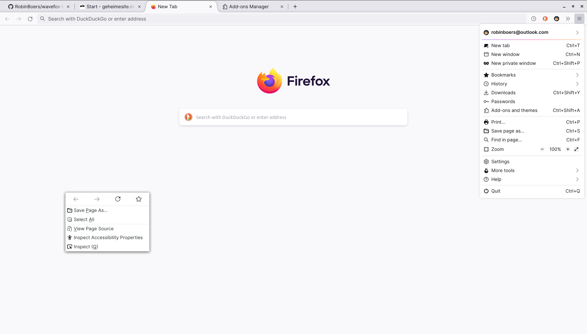

# :fox_face: Wavefox + Lepton
This is the user-friendly compact Lepton UI merged with the amazing looking Wavefox tabs. Together they make a fantastic browsing experience in our beloved Firefox browser.

I made some changes to both projects to make them fit toghether better. I made this for personal use, so the code I wrote is one big hack. It's horribe.

Tested on Firefox 90-91

